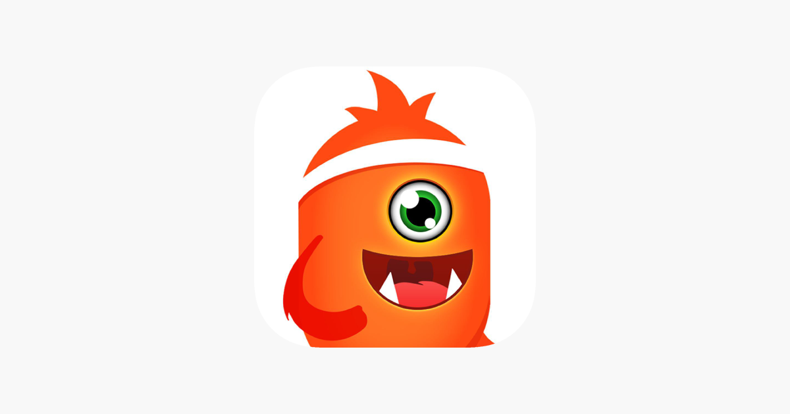

# Assignment 01
by Yifei Sun

## Project Idea: A Family Fitness APP
Inspired by my conversation with my parents, I want to design an app that help family members to create fitness plans, workout together or individually, share data and achievements. It can encourage family members to stay fit together and promote healthy habits.
My dad love sports and exercise every day. He cares a lot about whether I exercise regularly and have rest after sitting for a long time before the computer. I think a family fitness app will help me to be more motivated to workout with my family and live a healthier life.

### Heuristic evaluation
| Number | Heuristic | Description |
| --- | --- | ----------- |
| #1 | Visibility of system status | Text |
| #2 | Match between system and the real world | Text |
| #3 | User control and freedom | Text |
| #4 | Consistency and standards | Text |
| #5 | Error prevention | Text |
| #6 | Recognition rather than recall | Text |
| #7 | Flexibility and efficiency of use | Text |
| #8 | Aesthetic and minimalist design | Text |
| #9 | Help users recognize, diagnose, and recover from errors | Text |
| #10 | Help and documentation | Text |

## App 1: Exercise: At Home Workout App

Link: https://apps.apple.com/us/app/exercise-at-home-workout-app/id882240858

This app provides a variety of workouts that can be done at home, including yoga, pilates, and bodyweight exercises. It also includes customized workout plans based on fitness level and goals, and allows to track progress over time. Developed by a game company, the app uses gamification to create a fun and engaging experience of workout with cute avatars, animations and achievement system.
