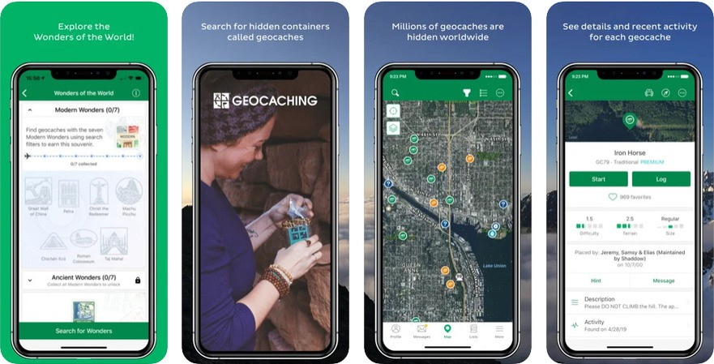

# Assignment 01: Heuristic Evaluation
### by Yifei Sun
DGT HUM 110: User Interface and Design

## Project Idea: A Family Fitness APP
### Tentitive Title: FFitness+ 
Inspired by my conversation with my parents, I want to design an app that help family members to create fitness plans, workout together or individually, share data and achievements. I would like to adopt gamefication elements to encourage family members to stay fit together and promote healthy habits.
My dad love sports and exercise every day. He cares a lot about whether I exercise regularly and have rest after sitting for a long time before the computer. I think a family fitness app will help me to be more motivated to workout with my family and live a healthier life.

## Heuristic Evaluation
| Number | Heuristic | Description |
| --- | --- | ----------- |
| #1 | Visibility of system status | Provide timely and appropriate feedback to keep users informed of the ongoing situation |
| #2 | Match between system and the real world | Present information in a natural and logical sequence that follows real-world conventions. |
| #3 | User control and freedom | Have a clearly marked exit to leave the unwanted action  |
| #4 | Consistency and standards | Follow platform and industry conventions |
| #5 | Error prevention | Remove conditions that are prone to errors, or verify them and offer a confirmation option |
| #6 | Recognition rather than recall | Promote recognition through interface and reduce the amount of cognitive effort required from users |
| #7 | Flexibility and efficiency of use | Flexible choices for both inexperienced and experienced users |
| #8 | Aesthetic and minimalist design | Information that is irrelevant or infrequently required should not be included |
| #9 | Help users recognize, diagnose, and recover from errors | Error messages should be written in plain language, indicate the issue, and offer a constructive solution. |
| #10 | Help and documentation | Provide documentation to help users understand how to complete tasks |

## Severity Ratings
| Rating | Description |
| --- | ----------- |
| 1 | Cosmetic problem only: need not be fixed unless extra time is available on project |
| 2 | Minor usability problem: fixing this should be given low priority |
| 3 | Major usability problem: important to fix, so should be given high priority |

## App Analysis 1: Exercise: At Home Workout App

Link: https://apps.apple.com/us/app/exercise-at-home-workout-app/id882240858

### Description
Exercise: At Home Workout App (also called 7 Minute Workouts with Lazy Monster) provides a variety of workouts that can be done at home, including yoga, pilates, and bodyweight exercises. It also includes customized workout plans based on fitness level and goals, and allows to track progress over time. 

### Overall Evaluation
Developed by a game company, the app mainly adopts gamification method to create a fun and engaging experience of workouts with cute avatars, animations and achievement system. Overall it reveals a good user experience design. It has well-organized layouts with a clear navigation system. The visual design is appealing, using bright and energetic colors. All these consistent elements are great fit for children as well as their parents as their targeted users.

### Heuristic evaluation

#### 1. Visibility of system status

| Rating | Evaluation  |
| --- | ----------- |
| 1 | In the workout session, the app has a countdown timer to help users know about current position during the process. To imporve, it can probably use a progress bar that is constantly shrinking to give the feeling of time. In addition, before starting each session, the app can provide an estimated time beforehand and let the users have an expectation. |

| Rating | Evaluation  |
| --- | ----------- |
| 3 | The app has problems with accessible design. While music and sound effects are important parts of guiding workout sessions, there is currently no accommodation for users who are hard of hearing or deaf. The app only provides animations and verbal instructions, which can be a barrier to accessibility for these users. To achieve better accessibility, the app can provide a text-based version that provides instructions in written form, which can help users who have trouble hearing to experience the app. |

#### 2. Match between system and the real world
| Rating | Evaluation  |
| --- | ----------- |
| 1 | The app does a great job using visual language and avoiding jargons. A cartoon character is guiding through the workout process, telling what movement to make by directly showing instead of depicting. There is not much text in this app, and most of them are plain language and easy to understand. |

#### 3. User control and freedom

| Rating | Evaluation  |
| --- | ----------- |
| 3 | The 'update profile' setting is problematic. When I enter the 'update profile' section, it directs me to the onboarding process where I have to enter my name, choose an avatar, and set my height and weight again. I have to go through the entire process one by one, and there is no button to quit this section. |

| Rating | Evaluation  |
| --- | ----------- |
| 2 | Sound effects and music appear in each workout session. However, there is no indication of the music elements on the screen. Though there is a sound setting in the setting section of the app, users are not able to control the music when they are in a workout session. The music also comes out really abruptly, and there is no indication for it. To improve the experience, it is better to have a small icon on the screen or a notification before the session starts to inform the users about setting the music. |

#### 4. Consistency and standards

| Rating | Evaluation  |
| --- | ----------- |
| 1 | The app uses conventional layout and user flows that are very easy to understand. The four sections are clearly divided at the bottom screen with text and icons. Profile section is on the top right corner. The main screen requires the user to swipe to interact. The behavior is clearly indicated with small dots at the bottom and the card layout style. |

#### 5. Error prevention

| Rating | Evaluation  |
| --- | ----------- |
| 2 | In each workout session, there is always an exit button in the top left corner of the screen. When the user clicks the button, it immediately exits the workout session and goes back to the main page. I think this makes it too easy to enter and exit a session, and users may have less motivation to complete the whole session. I would suggest having an extra window that asks users to confirm whether they want to exit and encourages them to stay and complete the tasks. |

#### 6. Recognition rather than recall

| Rating | Evaluation  |
| --- | ----------- |
| 3 | There is problem with recognizing previous information in the "Update Profile" setting. I have to re-enter all the information since it doesn't display the previous content I entered when I first created my account. Users would feel frustrated when clicking into this section and finding out that there is no way to exit unless they close the app or re-enter all their personal information again. |

#### 7. Flexibility and efficiency of user

| Rating | Evaluation  |
| --- | ----------- |
| 1 | In the setting, the app allows the users to select workout difficulty anytime according to their preference. It is direct and easy to find with clear indications workout session time information. The setting helps users aiming for different goals using the app to find it useful. |

#### 8. Aesthetic and minimalist design
| Rating | Evaluation  |
| --- | ----------- |
| 1 | The aesthetic of the app is super clean and engaging. There is not irrelevant information on the screen. Instructions are mostly illustrated by cartoon characters and animations. These elements are great fit for children who are targeted users of this app. |

#### 9. Help users recognize, diagnose, and recover from errors

 Rating | Evaluation  |
| --- | ----------- |
| 2 | There is not error message in the workouts session pages. In the profile setting section, there is a constraint on the values that can be input for the user's weight. If the number does not match a common human value, the system cannot proceed, and an inactive 'continue' button is displayed. The app can improve this by displaying error messages such as 'Please input a correct value.' |

#### 10. Help and documentation

| Rating | Evaluation  |
| --- | ----------- |
| 3 | The app does not include a section for help and documentation. If users meet difficulties using some features in the app, the only way to seek for help in the app is to send email to the support team. However, this method is not efficient to solve problems quickly. Users might feel frustrated and give up using if the problem is not solved immediately. The app can imporve this by adding a section of FAQ listing questions and answers users often have. |

## App Analysis 2: Geocaching

Link: https://www.geocaching.com/play

### Description
Geocaching is an outdoor recreational activity and mobile app for families that combines elements of treasure hunting, hiking, and navigation. The app allows users to locate hidden containers, called geocaches, using GPS coordinates. Geocaching is an engaging activity for people of all ages and promotes exploration, exercise, and problem-solving skills. It also fosters a sense of community among participants, as they work together to locate hidden treasures and share their discoveries with others.

### Overall Evaluation
Geocaching is an excellent tool for families looking to bond, stay active, and explore the outdoors together. It provides a unique experience that can strengthen family connections while offering educational and recreational benefits. The app encourages families to be physically active as they search for geocaches, combining exercise with the excitement of treasure hunting. It accommodates a wide range of ages and abilities, making it an inclusive activity for the whole family.

### Heuristic evaluation

#### 1. Visibility of system status

| Rating | Evaluation  |
| --- | ----------- |
| 1 | The app constantly updates the user's current location on the map and displays the distance and direction to the selected geocache, providing real-time feedback on their progress towards the target. |

| Rating | Evaluation  |
| --- | ----------- |
| 1 | When users log their geocache finds, the app updates the cache's status, marking it as found or not found. This feedback informs users that their actions have been successful and helps them keep track of their geocaching history.|

#### 2. Match between system and the real world

| Rating | Evaluation  |
| --- | ----------- |
| 1 |  The app uses a map-based interface to display geocache locations, which is a familiar and intuitive representation of the real world. This helps users easily understand their surroundings and navigate to the geocaches. |

| Rating | Evaluation  |
| --- | ----------- |
| 2 | The community has developed its own set of terms and abbreviations (e.g., "FTF" for "First to Find" or "TFTC" for "Thanks for the Cache"). These terms may be confusing to newcomers and could be better explained within the app to improve understanding. |

#### 3. User control and freedom

| Rating | Evaluation  |
| --- | ----------- |
| 1 | Users can apply filters to their geocache search, such as cache size, difficulty, terrain, or geocache type, providing control over the type of geocaches they want to find. |

#### 4. Consistency and standards

| Rating | Evaluation  |
| --- | ----------- |
| 1 | The app follows established design patterns and conventions commonly found in other apps, such as using recognizable icons and interaction behaviors. |

#### 5. Error prevention

| Rating | Evaluation  |
| --- | ----------- |
| 2 | When logging a geochache, there is not any option to undo if users click the buttons by mistake. The app can improve by adding a confirmation to prevent users from accidental mistakes. |

#### 6. Recognition rather than recall

| Rating | Evaluation  |
| --- | ----------- |
| 2 | The app uses visual cues, such as icons and color-coding, to help users recognize the status of geocaches. However, some icons does not exactly match the meaning of the function and causes confusion. |

| Rating | Evaluation  |
| --- | ----------- |
| 1 | Users can save geocaches to use it without Internet connection or add them to their favorites list. This enables quick access without having to remember or search for specific geocaches again. |

#### 7. Flexibility and efficiency of user

| Rating | Evaluation  |
| --- | ----------- |
| 1 | The activity that the app develops fits people of all age groups. Different people find it engaging in various ways through different methods of searching, such as using GPS coordinates, browsing a map, or searching by location name. Users are able to choose based on their preference and levels of experience. |

| Rating | Evaluation  |
| --- | ----------- |
| 1 | The app has a Attributes section for every geocaches which provides accommodation information as well as suggestions to find it. The attributes also have small icon to illustrate and help users to understand quickly. |

| Rating | Evaluation  |
| --- | ----------- |
| 3 | The app does not include a turtorial through the onboarding process. This might creates confusion for people using the app for the first time. The interface contains many numbers and jargons unique to this community, and requires explanation before the users start to explore. An onboarding experience is necessary to help users quickly fit to the community. |

#### 8. Aesthetic and minimalist design
| Rating | Evaluation  |
| --- | ----------- |
| 3 | The user interface design seem to be outdated and does not follow the latest design trend. There are still opportunities to further optimize the use of whitespace, ensuring that information and elements are presented in a balanced and visually appealing manner. |

| Rating | Evaluation  |
| --- | ----------- |
| 3 | Icons and illustrations are not in consistent styles through out the app. Some illustrations have contour lines, while others are flat. This might be disruptive for users to look at them and need further improvement. |

#### 9. Help users recognize, diagnose, and recover from errors

| Rating | Evaluation  |
| --- | ----------- |
| 1 | The search function provides examples to help prevent from mistakes looking up information with code. |

#### 10. Help and documentation

| Rating | Evaluation  |
| --- | ----------- |
| 1 | The app has a quick guide and help center, providing access to FAQs and troubleshooting guides through links. This could help users diagnose and resolve issues effectively and enjoy their journey. |
