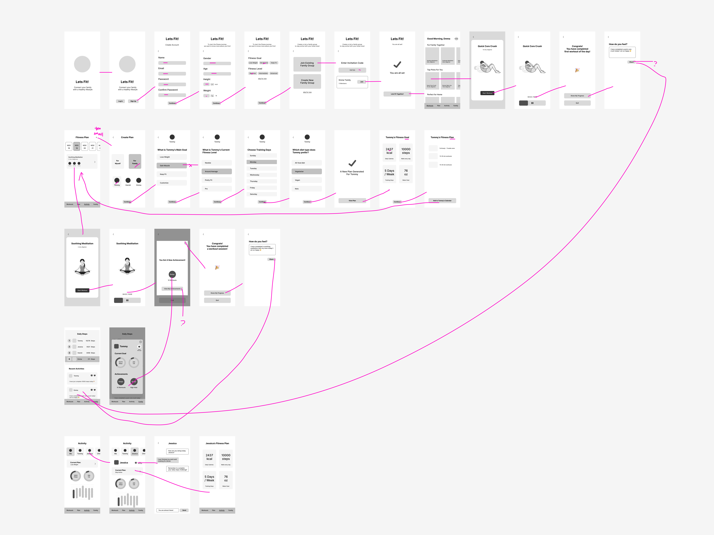

# Assignment 05: Low Fidelity Prototype

### by Yifei Sun
DGT HUM 110: User Interface and Design

## Overview

### User Research

The user research has shown that families are looking for ways to stay connected, motivated, and engaged in a healthy lifestyle. They value inclusiveness, continuous motivation, and the ability to share and track family fitness data.

Based on my contextual inquiry, I will focus on these three research questions:

- How might we keep users motivated and engaged about family activities?
- How might we improve the monitoring and communication between family members about their fitness and life?
- How might we create an inclusive experience to satisfy diverse interests and fitness levels in a family?

Here is more information on the <a href = "https://github.com/yfsun0920/DH110-2023Spring/blob/main/Assignments/A03/README.md"> user research </a>

### Persona

The target users are family members of different ages, fitness levels, and interests, who seek to improve their well-being, stay connected, and motivate each other in their fitness journeys. I created personas and scenarios centered around features that would solve each research question.

- A middle school boy who loves to play team sports and wants to spend more time with his parents.
- A busy working mother who aims to improve the overall health of the family and set a positive example for her children..
- An elderly man who cares about his children and grandchildren's well-being and wants to stay active himself.

Here is more information on the <a href = "https://github.com/yfsun0920/DH110-2023Spring/blob/main/Assignments/A04/README.md"> personas and scenarios </a>

### Features
1. Display daily fitness data of all family members
2. Customize fitness plans and provide tutorials for exercise that fit each family member's interest and fitness
3. Incorporate gamification elements, such as competition and badges, to motivate family members to engaged in more activities

### Purpose of the Low-fidelity Prototyping
The purpose of the low-fidelity prototyping in the design process is to visualize the app's features and seek validation of design concepts and user flows at an early stage. By creating a simple visual representation of the app's layout, content, structure, and functionality, designers can quickly iterate on ideas, identify potential usability issues, and evaluate whether it meets the goals of the target users. Additionally, low-fidelity prototyping allows designers to gather feedback from users, ensuring that the design decisions align with their expectations and preferences. This will leads to a more efficient design process and a better overall user experience in the final product.

## Wireframes & Wireflows
View wireframes and wireflows in <a href = "https://www.figma.com/file/CZlXnb6g29cyaJ69TkcDPR/Low-fidelity-Prototype?type=design&node-id=0%3A1&t=mkXwlZfStE5DySX2-1"> Figma file </a>

## Testing

## Reflection

Before the testing process, I did not give much information about the app since I want to avoid possible bias and observe how users might react to the prototype, I lead the users to go through the onboarding process and complete a first workout session. Then I ask her to navigate herself with the screen wireframes. It went smoothly since it is mostly the same as other apps that she normally used every day. She mentioned that it is especially important to have the skip for now option since she does not want to input too much personal information before being able to navigate the app. She pointed out the problem in creating or joining a family group. The instruction does not give information about what this family group can do.

Content design is probably the biggest challenges for me in the assignment. Since I am not a native speaker of English, I spent a lot of time figuring out how to write instructions clearly. At first I added many instructions to clarify the user flow since I think it might be hard for users to understand. From the user testing, I discovered that the tester could navigate smoothly even without reading all the instructions. She said she would prefer a simple and intuitive interface with minimal text. I will work on simplifying the user interface, using more visual cues and familiar patterns to guide. I will also try to reduce the amount of text on each screen or splitting them into different screens to make sure any necessary text is concise and easily understandable.

The tester also discovers some missing screens that I need to fix in my design as I iterate. Since I include a message feature that helps users to better communicate with their family, I also need to create a space for them to manage messages, create new ones and retrieve old ones.

I really enjoy the process of designing interactions in prototypes. For me I see every screen as a space, and my design helps to connect different spaces with intuitive actions. It is also important for me to consider edge cases all the time. I need to empathize different kinds of thoughts and goals users will probably have and provide them with a best option to meet their goals.

Overall, testing the low-fidelity prototype is an important step in the design process. It provides insights into user preferences, concerns, and behaviors, which will inform my subsequent design decisions and help me build an app that meets the needs of families.

