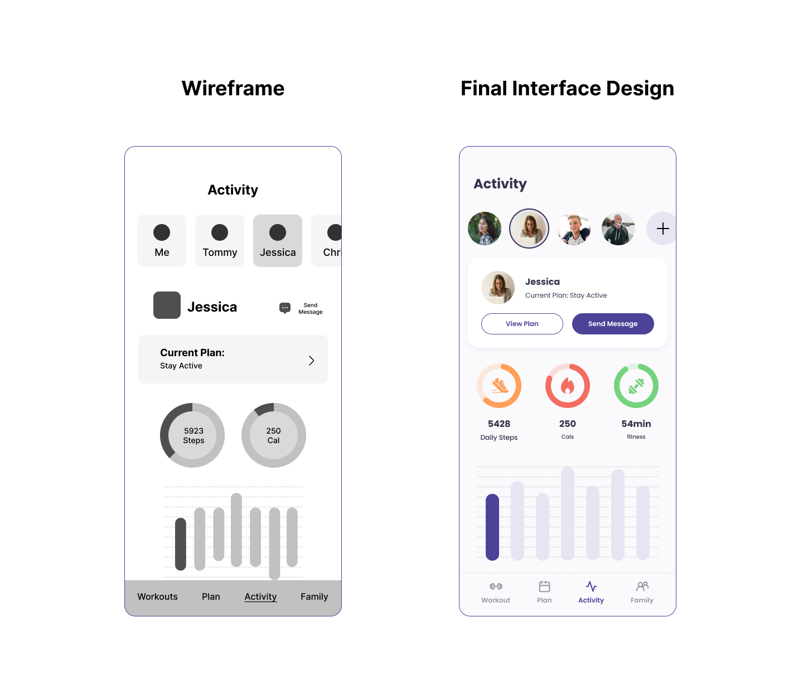

# Assignment 06: Interface Design

### by Yifei Sun
DGT HUM 110: User Interface and Design

## Introduction
### Summary
The family fitness app “LetsFit!” aims at fostering a healthier lifestyle among family members through shared fitness experiences and a sense of community. The app is intended to appeal to a wide range of family members, with differing fitness levels and interests, providing a platform to track individual and collective progress and engage in friendly competition.

### Purpose
The wireframe for this family fitness app was designed to be simple and intuitive, reflecting the needs and preferences of the user personas. It featured a clean layout with clear navigation options, ensuring users could easily find and use the app's various features.

The purpose of this interface design was not only to create a functional and user-friendly fitness app but also to facilitate connection, motivation, and healthy habits among family members. The app's design aims to strike a balance between individual fitness tracking and family-oriented features.

### Process

## Links to Figma File and Prototype
<a href = "https://www.figma.com/file/f1EACnj0NWnsMQFhAqcooE/Let's-Fit-Design-System?type=design&node-id=0%3A1&t=ccXm49ebEWVrGO8p-1"> Figma file </a> with screen design variations

## Screen Interface Designs

### Typography Variations

- For readability on screens and modern aesthetic, I choose to start with Sans Serif fonts. I try three fonts: Poppins, Roboto, and Graphik.

- I finally decide to use Poppins for its geometric, rounded characteristics, which make it look friendly and approachable. These align well with the fitness application that creates an engaging and warm environment for all family members regardless of age.

- Poppins is a versatile font that maintains good legibility across a wide range of sizes and weights. This ensures that all titles, instructions and fitness statistics can be easily read and understood.

### Spacing Variations

- The 8px spacing provides a compact look, and it might have made the interface feel too crowded. It could have led to difficulties in distinguishing between different elements on the screen. The 24px spacing provides ample space between elements, enhancing legibility, but large gaps allow less information to be displayed on one screen. User might have to constantly scroll vertically to view the full content.

- I choose the 16px spacing for its balance between legibility and efficient use of space. It allowed for clear separation between different elements, improving the readability of the interface. 16px is a common standard in many design systems due to its compatibility with a wide range of screen sizes and resolutions, making it a safe and reliable choice.

### Shape Variations

- When choosing the corner radius, I consider the aesthetic tone of the overall user experience.

- The 8px radius creates a semi-angular look. The sharpness might not align with the soft, friendly, and inclusive visual language that a family app typically embodies.

- A 16px radius was also tested. While it does soften the overall look, it might not fully express the approachability and inclusiveness you're looking to imbue in your design.

- I choose the 20px corner radius because of the decision to create a inclusive user interface that align with the progress circles.  It balances with other design elements to maintain consistency and reliability.

### Color Variations
.png)

.png)

- Purple is a color that can appeal to a wide demographic. It is often appreciated by both genders and across different age groups, which fits family members. The color has good contrast with both light and dark colors, making it a versatile choice that works well for text, buttons, and other UI elements against various backgrounds.

## Impression Test

Link to the <a href = "https://youtu.be/jTplI5S_XvE"> Impression Test Video </a>

### Pocess

In order to measure what information users take away and what impression they get when viewing a design, I conduct a five second impression test with two of the potential users.

I ask the tester to first look at the design for five seconds, and then ask them to recall what they have seen and guide them with some questions:
- What is the purpose of the page?
- What are the main elements you can recall?
- Who do you think the intended audience is?
- Did the design/brand appear trustworthy?
- What was your impression of the design?

### Insight from Quotes

- Connects elements to those in apps that often uses
> I think I remember seeing kind of something that looks like Instagram stories...

## Accessibility (color-contrast) check

I checked the contrast between the main text components of the app including backgrounds and texts. Both the light mode and dark mode color palettes pass the WCAG guidelines.

%20Accessibility%20Check.png)

%20Accessibility%20Check.png)

## Design System

